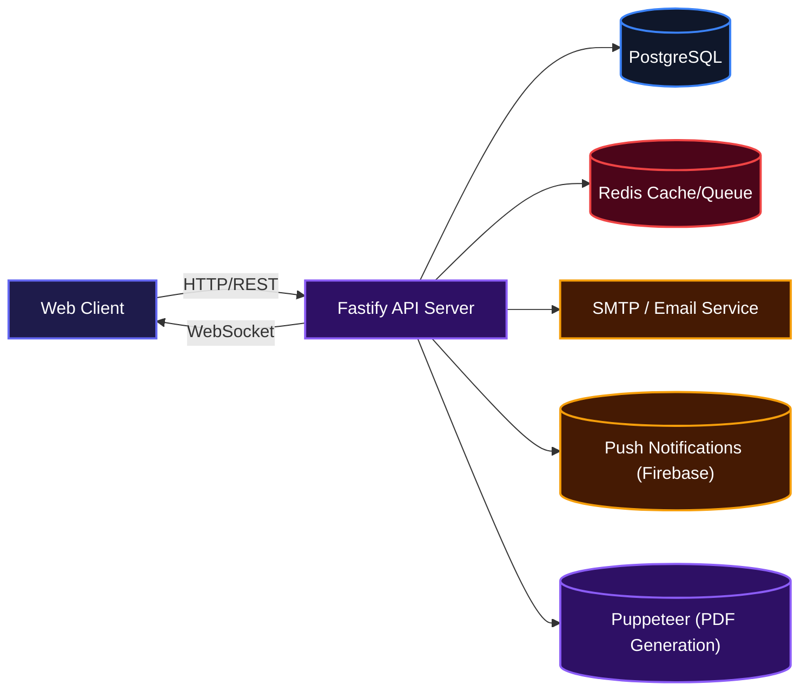
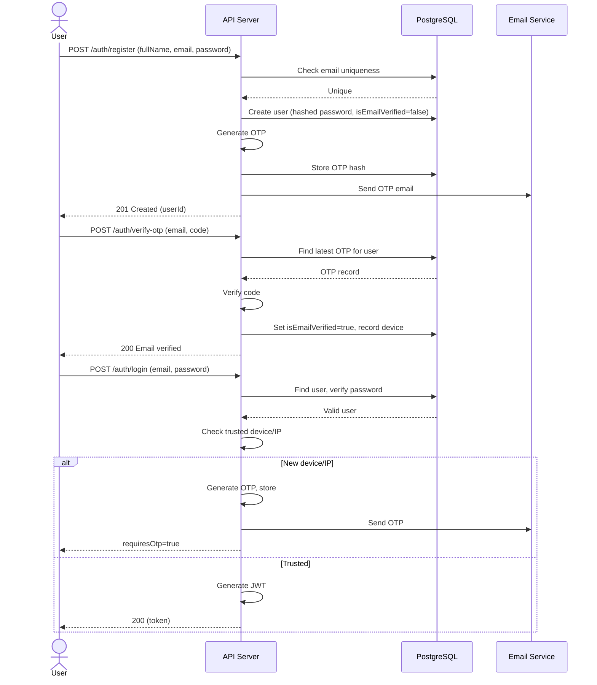
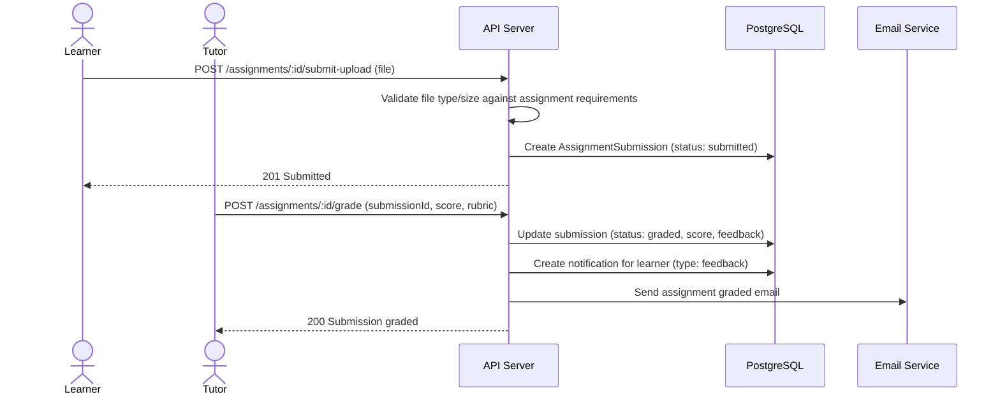

[](https://www.typescriptlang.org/)
[](https://nodejs.org/)
[](https://www.fastify.io/)
[](https://www.postgresql.org/)
[](https://redis.io/)
[](https://www.docker.com/)
[](https://docs.bullmq.io/)
[](https://pptr.dev/)

# LearnBridge API

A comprehensive LMS backend built with TypeScript and Fastify. It provides everything you need to run an online learning platform: user authentication, course management, enrollment, quizzes, assignments, certificates, real-time notifications, messaging, billing, admin tools, and more. The API is designed to be fast, secure, and easily extendable, making it a solid foundation for any educational product.

## Installation

Set up the project locally with a few commands.

- **Clone the repository**
  ```bash
  git clone https://github.com/oyinlola-tech/LMS.git
  cd LMS
  ```

- **Install dependencies**
  ```bash
  npm install
  ```

- **Set up environment variables**  
  Copy the example environment file and adjust values to match your local setup.
  ```bash
  cp .env.example .env
  ```
  The `.env.example` file contains all available variables with comments. At minimum, provide `DATABASE_URL`, `JWT_SECRET`, `PORT`, `UPLOAD_DIR`, and `SMTP_*` if you want email delivery.

- **Start supporting services**  
  The project includes a Docker Compose file for PostgreSQL and Redis. Start them in the background:
  ```bash
  docker-compose up -d
  ```

- **Run database migrations** (automatically applied on first boot when `DB_SYNC_ALTER=true`)
  ```bash
  npm run dev
  ```

The server listens on port `4000` by default. The Swagger documentation is available at `http://localhost:4000/docs`.

## Usage

Once the server is running, you can interact with the API directly or through the built-in Swagger UI. The Swagger UI provides a try-it-out interface and shows all endpoints with their request/response schemas.

To verify the server is healthy:
```bash
curl http://localhost:4000/api/health
```

The API returns a standard JSON wrapper for all responses:
```json
{
  "message": "Courses loaded",
  "data": [...]
}
```

Errors follow a consistent structure:
```json
{
  "error": {
    "code": "VALIDATION_ERROR",
    "message": "All fields are required",
    "details": null
  }
}
```

## System Architecture

Below is a high-level view of how the pieces fit together. The API server is built on Fastify with JSON schemas for validation, connects to a PostgreSQL database for persistent storage, uses Redis for optional job queuing (BullMQ) and real-time event broadcasting, and handles WebSocket connections directly for notifications and chat.



## Features

### 1. Authentication & Authorization

Supports email/password registration with OTP verification, login (including OTP-based login for new devices), and OAuth via Google and GitHub. All access is governed by JWT tokens, and role-based access control (learner, tutor, admin, super_admin) is enforced on every protected route.



### 2. Assignment Submission & Grading

Tutors create assignments inside course modules. Learners submit files (direct upload or URL) and track their progress. Tutors grade submissions against a configurable rubric, and the learner is notified instantly via email and in-app notification.



### 3. Real‑time Notifications & Chat

WebSocket connections deliver live notifications for course announcements, assignment grading, quiz results, and more. A separate WebSocket channel powers the chat feature, allowing learners and tutors to exchange messages in real time. Messages are persisted and threads are searchable.

### 4. Certificate Generation

When a learner completes a course, a PDF certificate is automatically generated using a custom HTML template and Chromium (via Puppeteer). The certificate includes the learner name, course title, instructor signature, a QR code for verification, and branding elements. Certificates are stored as files and also served via dedicated verification pages.

## Technologies Used

| Technology | Purpose |
|------------|---------|
| [TypeScript](https://www.typescriptlang.org/) | Language |
| [Node.js](https://nodejs.org/) | Runtime |
| [Fastify](https://www.fastify.io/) | HTTP framework |
| [Sequelize](https://sequelize.org/) | ORM (PostgreSQL) |
| [PostgreSQL](https://www.postgresql.org/) | Relational database |
| [Redis](https://redis.io/) | Caching / job queue (BullMQ) |
| [BullMQ](https://docs.bullmq.io/) | Background job processing (email queue) |
| [Puppeteer](https://pptr.dev/) | PDF certificate generation |
| [JSON Web Token](https://jwt.io/) | Authentication |
| [Argon2](https://github.com/ranisalt/node-argon2) | Password hashing |
| [Nodemailer](https://nodemailer.com/) | Email delivery |
| [WebSocket (ws)](https://github.com/websockets/ws) | Real‑time notifications and chat |
| [Firebase Admin](https://firebase.google.com/docs/admin/setup) | Push notifications |
| [QRCode](https://www.npmjs.com/package/qrcode) | QR code rendering |
| [PDFKit](https://pdfkit.org/) | Secondary PDF generation |
| [Docker](https://www.docker.com/) | Containerization |

## API Documentation

The API is accessible at `http://localhost:4000` (or your configured `PORT`). A detailed, interactive Swagger UI is available at `/docs`. Below is a summary of the main endpoint groups with examples.

### Authentication

| Method | Path | Description | Auth |
|--------|------|-------------|------|
| POST | `/auth/register` | Register a new learner | None |
| POST | `/auth/login` | Login (returns JWT or requires OTP) | None |
| POST | `/auth/verify-otp` | Verify OTP (email verification or login) | None |
| POST | `/auth/resend-otp` | Resend OTP | None |
| POST | `/auth/forgot-password` | Request password reset | None |
| POST | `/auth/reset-password` | Reset password with token | None |
| POST | `/auth/logout` | Logout (client should discard token) | None |

**Register Example**  
Request:
```json
{
  "fullName": "Jane Doe",
  "email": "jane@example.com",
  "password": "StrongPass123!",
  "confirmPassword": "StrongPass123!"
}
```
Response:
```json
{
  "message": "Registered. Please verify your email with the OTP.",
  "data": { "userId": "uuid" }
}
```

**Login Example**  
Request:
```json
{
  "email": "jane@example.com",
  "password": "StrongPass123!"
}
```
Response (with OTP required):
```json
{
  "message": "Verification code sent to your email",
  "data": { "requiresOtp": true, "userId": "uuid" }
}
```
Response (direct login):
```json
{
  "message": "Login successful",
  "data": { "token": "jwt_token" }
}
```

### Courses

| Method | Path | Description | Auth |
|--------|------|-------------|------|
| GET | `/courses` | List published courses (optional filters) | Optional |
| GET | `/courses/featured` | Get featured courses | Optional |
| GET | `/courses/recommended` | Get personalised recommendations | Required |
| GET | `/categories` | List all categories | Optional |
| GET | `/departments` | List departments with course counts | Optional |
| GET | `/courses/:id` | Course detail | Optional |
| POST | `/courses/:id/enroll` | Enroll in a course | Required |
| GET | `/courses/:id/announcements` | Get course announcements | Required |
| POST | `/courses/:id/announcements` | Create announcement (tutor only) | Required (tutor) |
| GET | `/courses/:id/comments` | Get course comments | Required |
| POST | `/courses/:id/comments` | Post a comment | Required |
| GET | `/courses/:id/reviews` | Get course reviews | Optional |
| POST | `/courses/:id/reviews` | Submit a review (course must be completed) | Required |

**Course Detail Example**  
Request: `GET /courses/uuid`  
Response:
```json
{
  "message": "Course loaded",
  "data": {
    "id": "uuid",
    "title": "Advanced UI Systems",
    "description": "...",
    "price": 49.99,
    "previousPrice": 79.99,
    "discountPercent": 38,
    "tutor": {
      "id": "...",
      "fullName": "Alex Kim",
      "avatarUrl": "..."
    },
    "sections": [...],
    "progressPercent": 45
  }
}
```

### Lessons

| Method | Path | Description | Auth |
|--------|------|-------------|------|
| GET | `/lessons/:id` | Get lesson detail and progress | Required |
| PUT | `/lessons/:id/progress` | Update playback progress | Required |
| POST | `/lessons/:id/complete` | Mark lesson as completed | Required |
| GET | `/lessons/:id/notes` | List personal notes for a lesson | Required |
| POST | `/lessons/:id/notes` | Add a note | Required |
| DELETE | `/lessons/:id/notes/:noteId` | Delete a note | Required |
| GET | `/lessons/:id/quiz` | Fetch quiz (creates new attempt) | Required |
| POST | `/lessons/:id/quiz/submit` | Submit quiz answers | Required |

**Submit Quiz Example**  
Request:
```json
{
  "attemptId": "attempt-uuid",
  "answers": [
    { "questionId": "q1", "optionId": "opt1" },
    { "questionId": "q2", "optionId": "opt2" }
  ]
}
```
Response:
```json
{
  "message": "Quiz submitted",
  "data": {
    "score": 8,
    "total": 10,
    "scorePercent": 80
  }
}
```

### Assignments

| Method | Path | Description | Auth |
|--------|------|-------------|------|
| GET | `/assignments` | List user-visible assignments | Required |
| GET | `/assignments/:id` | Assignment detail | Required |
| POST | `/assignments/:id/start` | Start an assignment | Required |
| POST | `/assignments/:id/submit` | Submit via file URL | Required |
| POST | `/assignments/:id/submit-upload` | Submit via file upload | Required |
| GET | `/assignments/:id/submission` | View own submission | Required |
| PUT | `/assignments/:id/submissions/:submissionId` | Update submission (before grading) | Required |
| GET | `/assignments/:id/submissions` | List all submissions (tutor) | Required (tutor) |
| POST | `/assignments/:id/grade` | Grade a submission (tutor) | Required (tutor) |

### Enrollments

| Method | Path | Description | Auth |
|--------|------|-------------|------|
| GET | `/enrollments/resume` | Get last accessed lesson | Required |
| GET | `/enrollments` | User’s enrollments | Required |
| GET | `/enrollments/:id` | Single enrollment detail | Required |
| PUT | `/enrollments/:id/progress` | Update completion progress | Required |
| POST | `/enrollments/:id/complete` | Mark course as completed | Required |

### Certificates

| Method | Path | Description | Auth |
|--------|------|-------------|------|
| GET | `/certificates` | List user’s certificates | Required |
| GET | `/certificates/:courseId` | Get certificate for a specific course | Required |
| POST | `/certificates/issue` | Issue certificate after completion | Required |
| GET | `/certificates/verify/:certId` | Verify certificate (JSON) | Public |
| GET | `/certificates/verify/:certId/page` | Verification page (HTML) | Public |
| GET | `/certificates/download/:certId` | Download certificate PDF | Public |
| GET | `/certificates/export/:certId` | Export as PNG or PDF | Public |
| GET | `/certificates/badge.png` | LearnBridge Verified badge | Public |

### Real‑time / WebSocket

| Endpoint | Description |
|----------|-------------|
| `ws://host:port/ws/notifications` | Stream live notifications (JWT in query `?token=`) |
| `ws://host:port/ws/messages` | Real‑time chat messages (JWT in query `?token=`) |
| `ws://host:port/ws/discussions` | Group discussion real‑time updates |

**WebSocket Authentication**  
All WebSocket connections require a valid JWT. Pass it as a query parameter `token=<jwt>` or via the `Sec-WebSocket-Protocol` header (bearer format).

### Additional Modules

- **User Profile & Settings**: `/users/me/*` and `/users/:id` (public profile)
- **Billing**: `POST /billing/subscribe`, `GET /billing/subscription`
- **Support Tickets**: `/support/tickets`, `/admin/support/tickets`
- **Mentorship Applications**: `POST /mentorship/apply`, `/mentorship/course/:courseId`
- **Tutor Tools**: Dashboard, student email broadcasts, office hours, gradebook, financial reports
- **Admin**: User management, instructor creation, platform settings, financial overview, payout approvals

Complete endpoint reference is available through Swagger at `/docs`.

### Environment Variables

All configuration is driven by environment variables. Reference the `.env.example` file for full details. Here are some key variables:

| Variable | Description | Default |
|----------|-------------|---------|
| `NODE_ENV` | Environment mode | `development` |
| `PORT` | Server port | `4000` |
| `DATABASE_URL` | PostgreSQL connection string | – |
| `JWT_SECRET` | Secret key for JWT tokens | – |
| `UPLOAD_DIR` | Directory for uploaded files | – |
| `SMTP_HOST`, `SMTP_PORT`, `SMTP_USER`, `SMTP_PASS` | Email delivery settings | – |
| `REDIS_ENABLED`, `REDIS_URL` | Enable Redis for queue/events | `false` |
| `EMAIL_QUEUE_ENABLED` | Use BullMQ for email jobs | `false` |
| `SUPER_ADMIN_EMAIL`, `SUPER_ADMIN_PASSWORD` | Auto-created super admin on first run | – |
| `GOOGLE_CLIENT_ID`, `GOOGLE_CLIENT_SECRET` | OAuth credentials | – |
| `GITHUB_CLIENT_ID`, `GITHUB_CLIENT_SECRET` | OAuth credentials | – |
| `CORS_ORIGIN` | Comma‑separated allowed origins | – |
| `RATE_LIMIT_MAX`, `RATE_LIMIT_WINDOW_MS` | General rate limiting | `200` / `900000` |
| `AUTH_RATE_LIMIT_MAX`, `AUTH_RATE_LIMIT_WINDOW_MS` | Auth rate limiting | `30` / `600000` |
| `JSON_BODY_LIMIT` | Max request body size | `1mb` |

## Contributing

Contributions are welcome. To propose changes, open an issue to discuss the idea, then submit a pull request with a clear description and tests where appropriate.

For security issues, please refer to the [Security Policy](https://github.com/oyinlola-tech/LMS/blob/main/SECURITY.md).

## Author

Built by Oluwayemi Oyinlola Michael.

- Website: [https://oyinlola.site](https://oyinlola.site)
- X (Twitter): [https://x.com/oyinlola141](https://x.com/oyinlola141)

